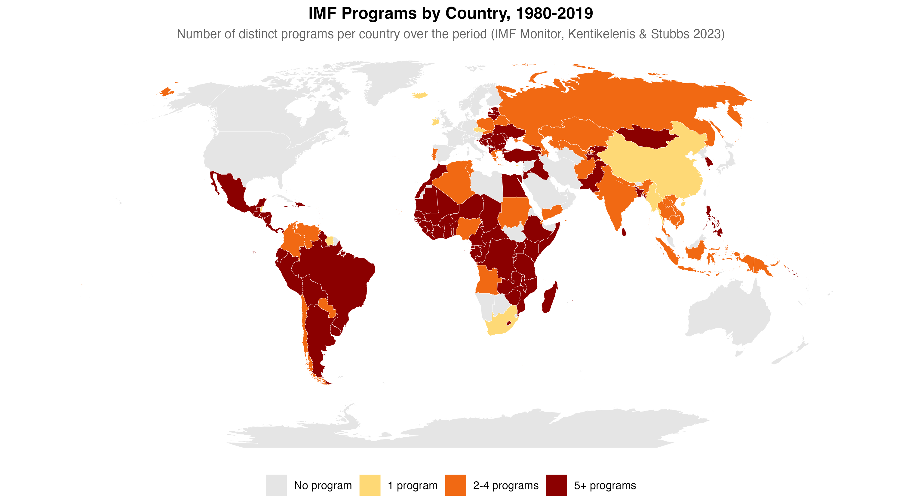
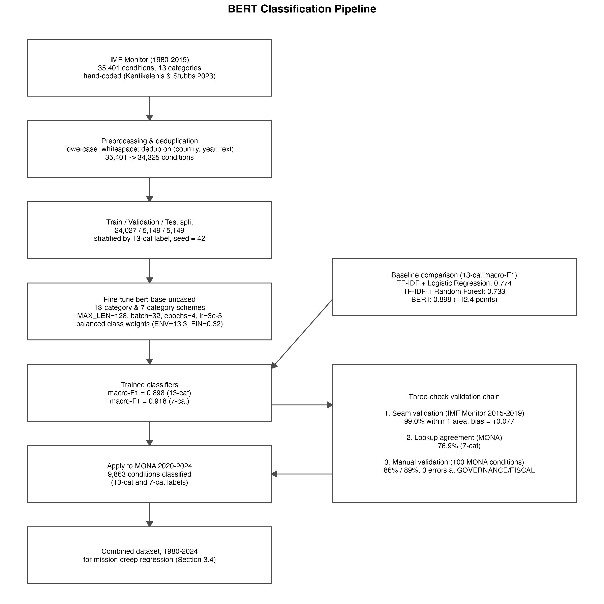
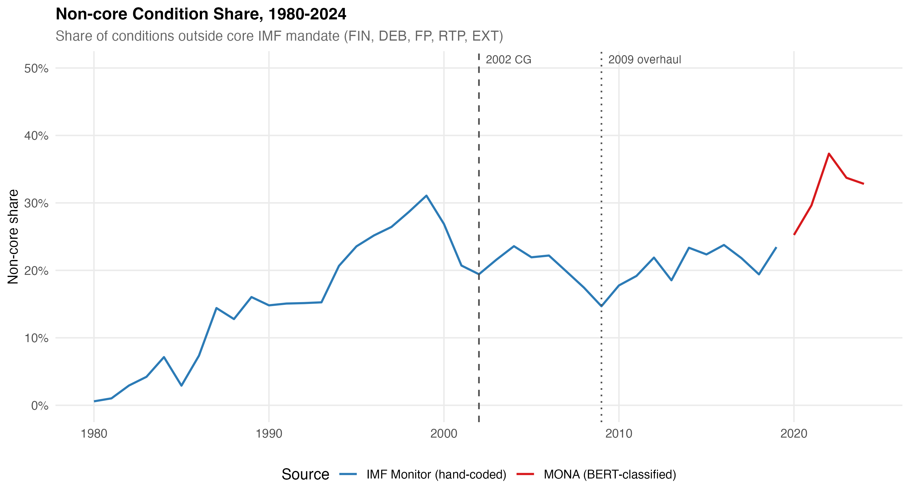

# Accept Terms and Conditions: Machine Learning Evidence of IMF Mission Creep, 1980-2024

Replication repository for the MSc thesis by Tommaso Accornero (2026),
Universidad Carlos III de Madrid, Department of Social Sciences.

This repository contains all code, outputs, and validation materials for
a study that fine-tunes a BERT classifier on 35,401 hand-coded IMF loan
conditions, extends the resulting time series to 2024 using MONA data,
and tests whether IMF policy scope expanded continuously despite two
formal streamlining reforms in 2002 and 2009.

## Key Results

The primary Poisson PPML regression (M3_extended, N = 2,086
program-years, IMF Monitor 1980-2019) finds:

-   Each additional year is associated with a 1.0% increase in the
    number of distinct policy areas covered (IRR = 1.010, p \< 0.001),
    after controlling for program size, type, and borrower
    characteristics.
-   The 2002 Conditionality Guidelines produced a temporary level
    reduction of 8.8% (IRR = 0.912, p \< 0.001) that was offset by
    continued scope growth within nine years.
-   The 2009 lending overhaul had no significant effect on policy scope
    (IRR = 0.999, p = 0.969).
-   The share of programs covering seven or more of thirteen available
    policy domains rose from 0% in 1985 to 61.9% in 2019.
-   The GOVERNANCE category (institutional reform, environmental policy,
    residual structural conditions) tripled from 3.9% to 13.2% of
    conditions between the IMF Monitor and MONA periods.

The BERT classifier achieves a macro-F1 score of 0.898 on the
13-category scheme and 0.918 on the 7-category scheme, against a TF-IDF
baseline of 0.774.

## Figures







## Repository Structure

```
bert-imf-conditionality/
├── R/
│   ├── 01_data_preparation.R
│   ├── 02_category_mapping.R
│   ├── 03_exploratory_analysis.R
│   ├── 03b_build_controls.R
│   ├── 04_mission_creep_analysis.R
│   ├── 05_model_comparison_table.R
│   ├── 06_bert_pipeline_diagram.R
│   ├── 07_country_coverage_map.R
│   ├── 08_model_fit_diagnostics.R
│   └── utils/
│       └── plotting_theme.R
├── python/
│   ├── 01_preprocess_for_bert.py
│   ├── 02_baseline_models.py
│   ├── 03_train_bert_13cat.py
│   ├── 04_train_bert_7cat.py
│   ├── 05_predict_mona.py
│   ├── 06_evaluate_temporal.py
│   └── 06b_seam_validation.py
├── results/
│   ├── figures/
│   ├── tables/
│   ├── validation/
│   └── diagnostics/
├── data/
│   ├── raw/
│   │   ├── IMFMonitor_Conditionality_Raw.xlsx
│   │   ├── Combined.xlsx
│   │   ├── SYSTEMIC BANKING CRISES DATABASE_2018.xlsx
│   │   └── category_mapping.csv
│   └── processed/
│       ├── label_encoder_13cat.json
│       └── label_encoder_7cat.json
├── models/                         (not committed, see Models section)
├── requirements.txt
├── LICENSE
└── README.md
```

## Data

The raw input files and mapping outputs are included in this repository
under data/raw/ and data/processed/. Processed intermediates and the
final combined dataset are not committed and are regenerated by running
the pipeline.

**IMF Monitor (Kentikelenis and Stubbs, 2023)**
35,401 hand-coded IMF loan conditions from 1980 to 2019 across 134
countries and 13 policy categories. Included at
data/raw/IMFMonitor_Conditionality_Raw.xlsx. Original source:
https://dataverse.harvard.edu/dataverse/imfmonitor

**MONA (IMF, 2024)**
The IMF self-reported Monitoring of Fund Arrangements database, covering
2000 to 2025. Included at data/raw/Combined.xlsx. Original source:
https://www.imf.org/en/Data

**Laeven and Valencia (2018) crisis database**
Systemic Banking Crises Database (2018 edition), used to construct the
`any_crisis` control variable. Included at
data/raw/SYSTEMIC BANKING CRISES DATABASE_2018.xlsx. Original source:
https://www.imf.org/en/Publications/WP/Issues/2018/09/14/Systemic-Banking-Crises-Revisited-46232

**MONA descriptor mapping**
Manual mapping of 33 MONA Economic Descriptors to the IMF Monitor
13-category scheme, with confidence ratings and decision notes for each
assignment. Included at data/raw/category_mapping.csv.

**GDP per capita (World Bank WDI)**
Downloaded automatically by R/03b_build_controls.R via the WDI package.
No manual download required.

**Label encoders**
Integer mappings for the 13-category and 7-category classification
schemes, used by all Python training and inference scripts. Included at
data/processed/label_encoder_13cat.json and
data/processed/label_encoder_7cat.json.

## Models

Trained BERT model weights are not committed due to file size
(approximately 440 MB per model). To reproduce the models, run the
Python pipeline in the order described below. The fine-tuned models can
also be made available on request.

## Installation

**Python**

Tested on Python 3.10. Install dependencies via:

```         
pip install -r requirements.txt
```

A GPU (CUDA or Apple Silicon MPS) is strongly recommended for training
scripts 03 and 04. Inference scripts (05, 06, 06b) run acceptably on
CPU.

**R**

Tested on R 4.3. Install required packages:

```         
install.packages(c(
  "tidyverse", "conflicted", "readxl", "WDI", "countrycode",
  "rnaturalearth", "rnaturalearthdata", "sf",
  "lmtest", "sandwich", "broom", "patchwork", "scales",
  "MASS", "glmmTMB", "modelsummary", "car"
))
```

## Running the Pipeline

All scripts must be run from the project root. Run them in the order
listed.

**Stage 1: Data preparation (R)**

```         
Rscript R/01_data_preparation.R
Rscript R/02_category_mapping.R
Rscript R/03b_build_controls.R
```

**Stage 2: Exploratory analysis (R)**

```         
Rscript R/03_exploratory_analysis.R
```

Note: R/03_exploratory_analysis.R requires
data/final/mona_classified.csv for figure 11. Run Stage 3 first if you
want the full 1980-2024 figure, or comment out the fig_11 block for the
IMF Monitor figures only.

**Stage 3: BERT classification (Python)**

```         
python python/01_preprocess_for_bert.py
python python/02_baseline_models.py
python python/03_train_bert_13cat.py
python python/04_train_bert_7cat.py
python python/05_predict_mona.py
python python/06_evaluate_temporal.py
python python/06b_seam_validation.py
```

python/06_evaluate_temporal.py runs in two modes. On first run it
exports a 100-condition sample for manual coding. After filling in the
manual_category column and saving as validation_sample_coded.csv, re-run
to compute agreement statistics.

**Stage 4: Mission creep regression (R)**

```         
Rscript R/04_mission_creep_analysis.R
Rscript R/05_model_comparison_table.R
```

R/05 must be run in the same R session as R/04, or R/04 must be sourced
first so that model objects are available in memory.

**Stage 5: Figures and diagnostics (R)**

```         
Rscript R/06_bert_pipeline_diagram.R
Rscript R/07_country_coverage_map.R
Rscript R/08_model_fit_diagnostics.R
```

R/07 and R/08 must be run after R/04 (require imf object and m3_extended
in memory respectively, or load from the processed CSV).

## Reproducibility

All random seeds are fixed at 42. Python seeds are set via
random.seed(42), numpy.random.seed(42), and torch.manual_seed(42). R
seeds are set via set.seed(42) and passed to train_test_split via
random_state=SEED.

The train/validation/test split (70/15/15, stratified by 13-category
label) is produced by python/01_preprocess_for_bert.py and is fully
deterministic given the seed and input data.

GPU training results may vary marginally across hardware due to
floating-point non-determinism in CUDA operations. The macro-F1 scores
reported in the thesis (0.898 and 0.918) were obtained on Apple Silicon
(MPS device). Results on CUDA hardware should be within 0.005 of these
values.

## Citation

If you use this code or build on this analysis, please cite:

Accornero, T. (2026). Accept Terms and Conditions: Machine Learning
Evidence of IMF Mission Creep, 1980-2024. MSc thesis, Department of
Social Sciences, Universidad Carlos III de Madrid.

The IMF Monitor dataset should be cited as:

Kentikelenis, A. and Stubbs, T. (2023). A Thousand Cuts. Oxford
University Press.

## License

The code in this repository is released under the MIT License. See
LICENSE for details.

The IMF Monitor dataset is subject to the terms of the Harvard Dataverse
and the original publication. The MONA database is the property of the
International Monetary Fund. Neither dataset is redistributed here.
